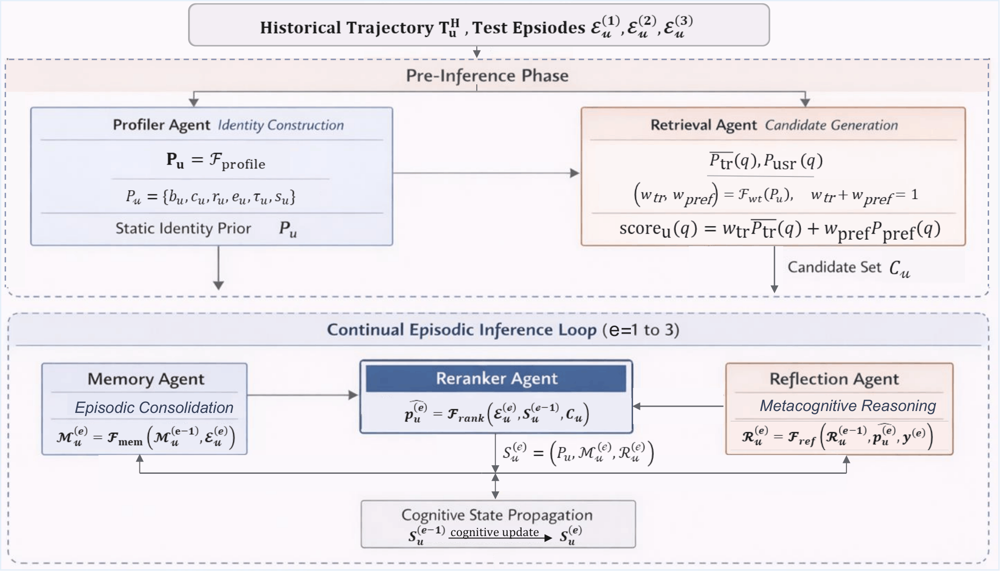

# CogMaPOI: A Cognition-Inspired Multi-Agent Framework for Next POI Recommendation

> **Continual episodic inference for next point-of-interest prediction — no fine-tuning required.**

[](./Research%20Papers/)
[](https://www.python.org/)
[](LICENSE)

---

## Overview

CogMaPOI reframes next POI recommendation as **continual episodic inference**. Unlike conventional approaches that treat each prediction independently, CogMaPOI maintains a structured cognitive state across successive prediction episodes — mirroring how humans actually navigate spaces.

The system is powered by a **five-agent LLM architecture** with three mutually interacting cognitive components:

| Component | Description |
|---|---|
| 🧠 **Identity Prior** | Stable long-term user preferences, built once from historical data |
| 💾 **Episodic Memory** | Natural-language summaries of test-session behaviour, updated each episode |
| 🔍 **Metacognitive Reflection** | Evaluates past predictions, reinforces what worked, revises what didn't |

All state evolution proceeds through **structured prompt updates — zero parameter modifications**.

---

## Key Results

Evaluated on three Foursquare datasets against **13 baselines**, CogMaPOI achieves:

| Dataset | MRR Improvement | HR@5 Improvement |
|---|---|---|
| NYC | +56.88% | +18.53% |
| TKY | +46.36% | +0.85% |
| CA | **+89.35%** | +41.42% |

The large MRR gains (versus more modest HR gains) reflect the framework's core strength: **ranking the correct POI higher**, not just recovering it more often.

---

## Architecture

<p align="center">
  
  <br>
  <em>Figure 1: CogMaPOI five-agent pipeline with continual episodic inference and cognitive state updates.</em>
</p>

Five agents, strictly causal — episode *e* information cannot influence episode *e*'s own prediction.

---

## Repository Structure

```
CogMaPOI/
├── cogmapoi-complete-pipeline.ipynb    # Full end-to-end pipeline
├── __Architecture_Diagram.png          # Architecture diagram
├── README.md                           # This file
├── Ablation studies codes/
│   ├── cogmapoi-without-memory-agent.ipynb
│   ├── cogmapoi-without-reflection-agent.ipynb
│   └── cogmapoi-without-memory-reflection-agents.ipynb
├── Datasets/
│   ├── ca_train.jsonl / ca_test.jsonl
│   ├── nyc_train.jsonl / nyc_test.jsonl
│   ├── tky_train.jsonl / tky_test.jsonl
│   └── readme.txt
├── Results/
└── Research Papers/
```

---

## Datasets

Three Foursquare check-in datasets are included under `Datasets/`:

| Dataset | Users | POIs | Check-ins | Period |
|---|---|---|---|---|
| NYC | 988 | 5,086 | 99,964 | Apr 2012 – Feb 2013 |
| TKY | 2,206 | 7,849 | 325,313 | Apr 2012 – Feb 2013 |
| CA | 1,818 | 13,564 | 174,791 | Feb 2009 – Oct 2010 |

Each record carries: user ID, POI ID, semantic category, GPS coordinates, and timestamp. The final 30 check-ins per user form the test trajectory; all earlier check-ins serve as historical data.

---

## Getting Started

### Requirements

- Python 3.8+
- PyTorch
- Transformers (`pip install transformers`)
- BitsAndBytes (`pip install bitsandbytes`)
- Jupyter Notebook

### Installation

```bash
git clone https://github.com/amrutha0001/CogMaPOI-A_Cognition_Inspired_Multi-Agent_Framework_for_Next_POI_Recommendation.git
cd CogMaPOI-A_Cognition_Inspired_Multi-Agent_Framework_for_Next_POI_Recommendation
pip install -r requirements.txt
```

### Running the Full Pipeline

Open and run `cogmapoi-complete-pipeline.ipynb`. The notebook walks through:

1. Loading and preprocessing the dataset
2. Pre-inference phase: Profiler + Retrieval agents
3. Continual episodic inference loop (Episodes 1–3)
4. Evaluation on Episode 3 predictions

### Running Ablation Studies

Individual ablation notebooks are available under `Ablation studies codes/`:

```bash
# Without memory agent
jupyter notebook "Ablation studies codes/cogmapoi-without-memory-agent.ipynb"

# Without reflection agent
jupyter notebook "Ablation studies codes/cogmapoi-without-reflection-agent.ipynb"

# Without both
jupyter notebook "Ablation studies codes/cogmapoi-without-memory-reflection-agents.ipynb"
```

---

## Implementation Details

| Setting | Value |
|---|---|
| Backbone | Llama 3.1-8B-Instruct |
| Quantisation | 4-bit NF4 (BitsAndBytes) |
| Compute dtype | FP16 with double quantisation |
| Temperature | 0.2 |
| Max output tokens | 200 |
| Inference passes/episode | 2 (averaged) |
| Candidate set size (K) | 125 |
| Transition window (L) | 2 |
| Hardware | NVIDIA RTX 2000 Ada |

The framework is backbone-agnostic. Experiments with Mistral 7B, Qwen 2.5-5B, Qwen 1.5-7B, Llama 3.2-3B, and Qwen 2.5-3B all outperform the best static baseline.

---

## Ablation Results (NYC)

| Configuration | HR@5 | MRR | Notes |
|---|---|---|---|
| **CogMaPOI (full)** | **64.67** | **63.19** | — |
| w/o Memory | 60.02 | 57.96 | Uniform contextual degradation |
| w/o Reflection | 57.01 | 62.12 | Primarily hurts top-5 precision |
| w/o Both | 51.76 | 50.66 | Larger than additive loss |

Memory and reflection make **complementary, non-redundant contributions**: memory enriches context broadly; reflection specifically targets top-1 ranking precision.

---

## Evaluation Protocol

- Metrics are computed **exclusively on Episode 3** predictions
- Episodes 1 and 2 serve as cognitive warm-up cycles
- This ensures one-to-one comparability with single-shot baselines
- Primary metrics: **HR@5, HR@10, NDCG@5, NDCG@10, MRR**

---

<!--
## Citation

If you use CogMaPOI in your research, please cite:

```bibtex
@inproceedings{cogmapoi2025,
  title     = {...},
  author    = {...},
  year      = {2025}
}

---
-->

## Acknowledgements

Baselines and dataset splits follow the unified evaluation protocol of [CoMaPOI (SIGIR 2025)](https://doi.org/10.1145/3726302.3729930). We thank the authors for making their evaluation setup publicly available.

---
<!--
## License

This project is licensed under the MIT License. See [LICENSE](LICENSE) for details.
-->
